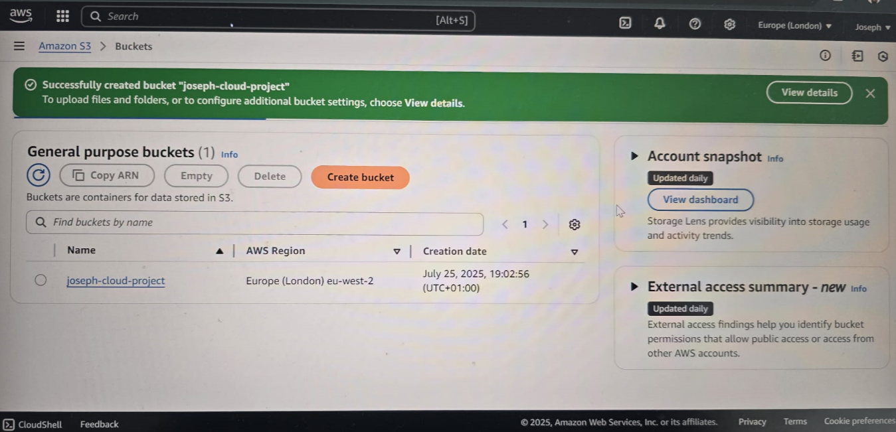
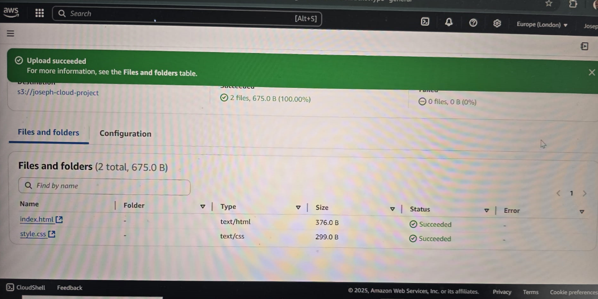
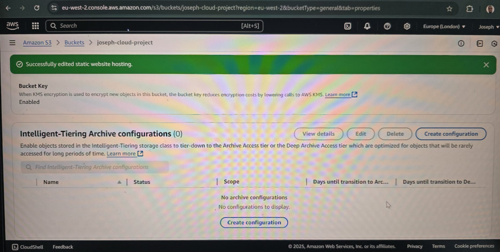
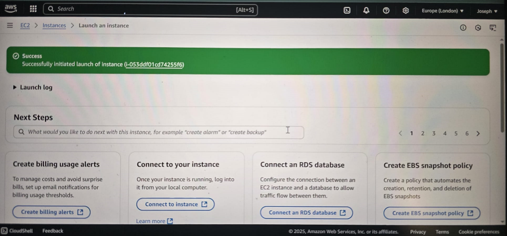
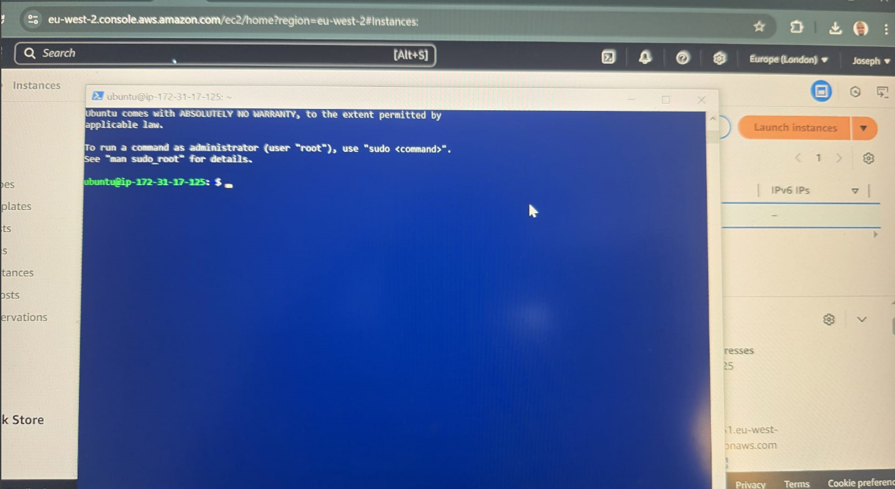
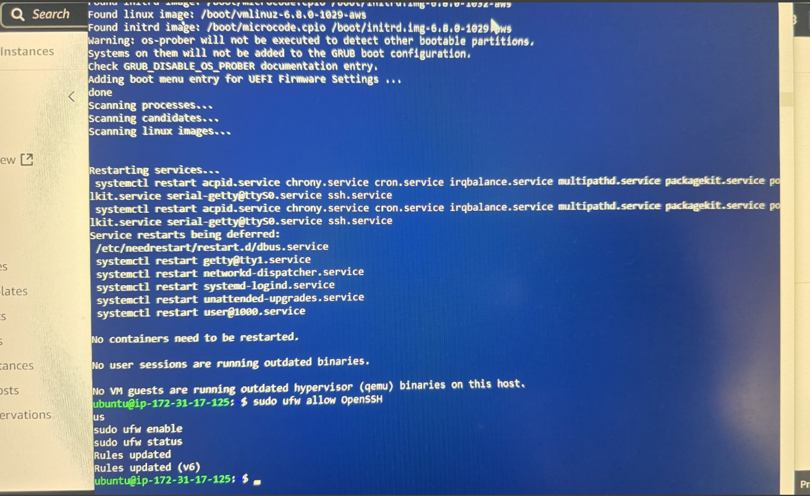
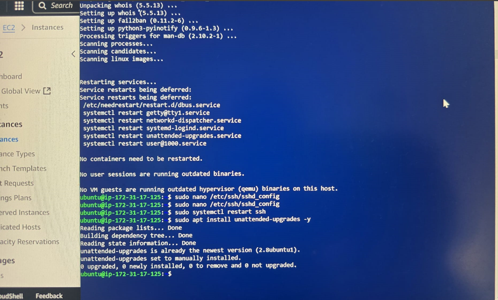
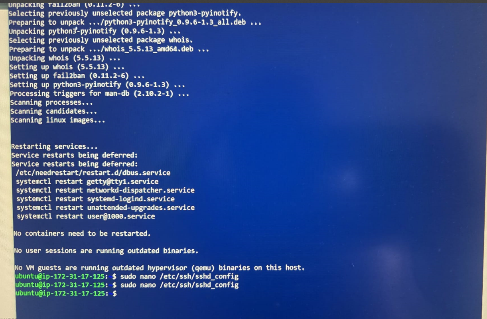
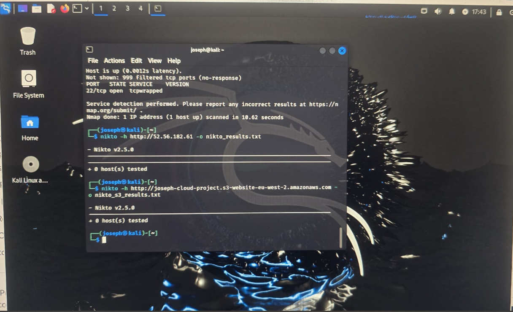

#  Secure Cloud Web Hosting & Vulnerability Assessment

This project demonstrates a secure cloud deployment using AWS services like S3 and EC2, along with basic Linux hardening techniques and vulnerability assessments. Screenshots are included to show implementation steps and results.

---

##  Repository Structure

```
secure-cloud-project/
├── README.md                 # This file
├── website/                  # Static site files
│   ├── index.html
│   └── style.css
└── screenshots/              # Proof-of-work images
    ├── snapshot1.png         # S3 bucket created
    ├── snapshot2.png         # Files uploaded
    ├── snapshot3.png         # Static website enabled
    ├── snapshot4.png         # Bucket policy applied
    ├── snapshot5.png         # Website opened in browser
    ├── snapshot6.png         # EC2 instance launched
    ├── snapshot7.png         # SSH into VM
    ├── snapshot8.png         # UFW firewall status
    ├── snapshot9.png         # SSH hardening config
    ├── snapshot10.png        # Automatic updates
    ├── snapshot11.png        # Nmap scan result
    └── snapshot12.png        # Nikto S3 scan result
```

---

##  Snapshot Previews

###  S3 Bucket Created


###  Files Uploaded


###  Static Website Enabled


###  Bucket Policy Applied


###  Website Opened in Browser


###  EC2 Instance Launched


###  SSH into VM


###  UFW Firewall Status


###  SSH Hardening Config


###  Automatic Updates


###  Nmap Scan Result


###  Nikto S3 Scan Result


---

##  Tools & Services Used

- **AWS S3** – Static website hosting
- **AWS EC2** – Secure Linux virtual machine
- **UFW** – Basic firewall rules
- **Bash** – Server hardening scripts
- **Nmap / Nikto** – Vulnerability scanning

---

##  Notes

All configurations were done manually to demonstrate core cloud deployment and basic security measures. Screenshots serve as proof of implementation and assessment.

---

##  Contact

Joseph  
📧 joseph.sanwo1@gmail.com 
🔗 [GitHub Profile](https://github.com/jsanwo85)
